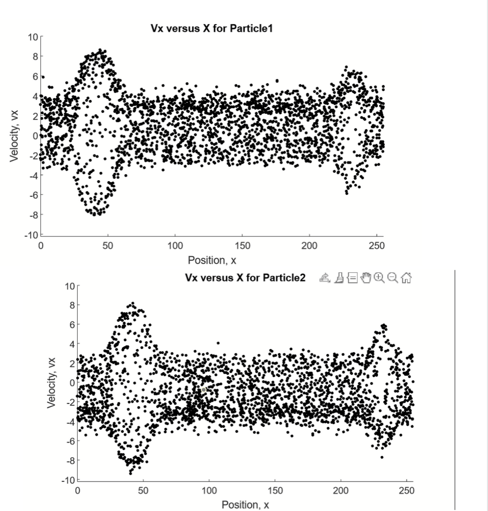

# wpic1d
1D PIC simulation for AS708 Cosmic Plasma Physics (Oppenheim). Created by William Longley, extended by Kshitij Duraphe.

Any doubts about how to run code to recreate conditions for problems can be emailed to me (kshitijd[at]bu.edu)

Results such as  can be produced and are required for some homework problems.
